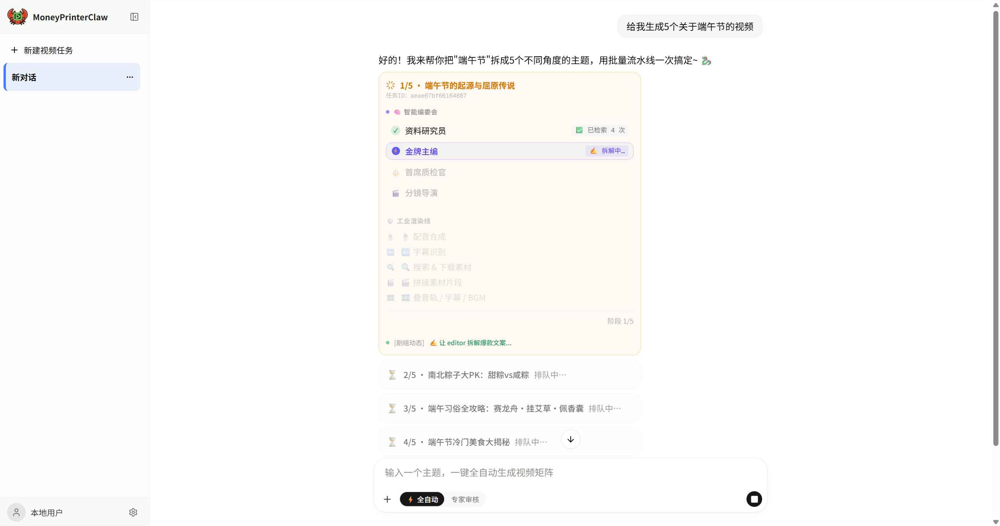
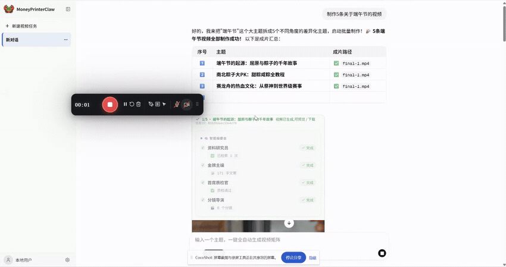

<div align="center">

# 🦞 MoneyPrinterClaw

**首个基于多智能体（Multi-Agent）编排的工业级全自动短视频矩阵工厂**

[]()
[]()
[]()
[]()

**简体中文** · [English](README_en.md) · SaaS 级容灾 · 纯自然语言驱动

</div>

---

> 给出一个模糊的主题，例如「做 5 个端午节习俗的差异化视频」，剩下的全部交给 Agentic Workflow：**找素材、写脚本、配音、对字幕、合视频、审稿**。中途断电、网络抖动、LLM 偶发抽风？系统自动从最近的检查点（Checkpoint）精准复活，彻底告别从零重跑的雪崩噩梦。

<div align="center">
<h4>Web界面</h4>



</div>
<div align="center">
  <br/>
  
  <br/>
  <br/>
  <p><b>⚡ 4大高内聚打工人多线柔性拉扯 + 纯 FFmpeg 工业流水线串行批跑实况（12倍速激燃呈现）</b></p>
</div>

## 💡 为什么需要 MoneyPrinterClaw？

传统视频生成脚本依赖刚性、线性的 Pipeline，面对网络抖动、文案微调时极易导致整条流水线崩溃。

**MoneyPrinterClaw 是一次底层架构的彻底重构。** 我们颠覆了线性控制，放弃了“一段大 Prompt 走天下”的玩具模式，引入了 **SOP 驱动的智能体编排（Agentic Workflow）**。用户只需在对话框输入宏观概念，系统便会激活全扁平化多智能体拓扑，自主完成无人值守状态下的高保真视频矩阵生产。

### ⚔️ 核心架构对标与升维

| 痛点维度 | 传统 Pipeline 脚本项目 | **MoneyPrinterClaw (本项目 🚀)** |
| --- | --- | --- |
| **交互模式** | 僵硬的 Web 表单填空（Streamlit） | **💬 聊天驱动：基于 assistant-ui 的沉浸式对话编辑部** |
| **打工人架构** | 单体大模型盲目输出，要素极易漂移 | **👥 4 大高内聚 Worker 平铺（资料/编剧/主编/导演），解耦迭代** |
| **容灾与续传** | 进程被杀需从头重跑，产生幽灵重复任务 | **🛑 双重状态自愈：LangGraph 节点级快照 + 磁盘子步级账本** |
| **工作流流转** | 代码硬编码连线，无法打回重写 | **🧠 软编码流：大模型扮演 Supervisor，按 SOP 柔性调度路由** |
| **多媒体管线** | 依赖笨重的 Python 视频库，极易 OOM | **⚡ 纯 FFmpeg 复合滤镜冷锻拼接，8段素材 10秒 极速渲染成品** |

---

## 🎯 核心特性解析

- **[x] HITL（人机协同）断点审稿**：引入 LangGraph `interrupt` 一等公民机制，前端弹出审稿卡。您可以随时接管修改 Agent 生成的文案或分镜词，再让引擎继续渲染。
- **[x] SaaS 级状态自愈与断点续传**：
  - *软自愈*：调用外部素材 API 偶发丢包时，无状态指数退避重试，绝不波及主流程。
  - *硬容灾*：`AsyncSqliteSaver` 实时落盘 superstep；底层的 `progress.json` 提供原子级跳步保护。即使断电重启，系统也能从“素材下载至 5/9”处毫秒级原地复活。
- **[x] 动态子图工厂 (YAML Driven)**：新增一个 Agent 只需新建一份 YAML 配置文件，零侵入核心业务代码即可挂载至主图。
- **[x] 批量高并发生产**：一句“生成 5 个系列视频”，即可串行批跑。独立的 `task_id` 与物理隔离的持久化存储，确保单条失败绝不影响全局矩阵。
- **[x] SSE 实时工业监控**：后端通过 `adispatch_custom_event` 推送亚秒级阶段进度，前端以动态进度卡与工业级控制面板实时呈现。
- **[x] 多比例与异构模型兼容**：完美支持 9:16 / 16:9 / 1:1。默认接入 DeepSeek（高智商/低成本），兼容任意 OpenAI 标准的端点。

---

## 🚀 硬核架构剖析 (For Geeks & Architects)

### 1. 🗺️ SOP 驱动的扁平化多智能体编排 (Flattened Orchestration)

基于 **LangGraph** 最新设计范式，解构传统嵌套图的黑盒真空，将调度中枢 `supervisor_route` 与 4 大专业打工人（`researcher` 联网检索、`editor` 创作修改、`reviewer` 指标质检、`director` 拆分镜）全量平铺注册在根图上。由大模型严格遵循 Markdown 格式的行业标准作业程序（SOP）进行微观自主路由，确保创意的柔性与混沌度，同时物理锁定 Token 侧漏防线。

### 2. 🛡️ SaaS 级长周期事务容灾与断点自愈 (Crash Recovery)

拒绝为了容灾去考验大模型在断点苏醒时的道德与记忆力。系统落地了“双层断点闸门”控制：

* **软自愈**：在调用博查搜索（Bocha API）或 Pexels 视频网关发生网络偶发丢包时，由 `tenacity` 触发节点内无状态退避重试，前端卡片 1:1 串行原地加载。
* **硬容灾**：触发硬错误被杀进程后，重启触发 `/continue` 续传，`_compute_can_continue` 闸门会精准保护已完成的真片快照，并指导状态机 0 毫秒跳步复活；下游执行车间通过物理磁盘 `progress.json` 账本执行“业务层跳过”，绝不重复消费 Token。

### 3. 🎙️ 工业级多媒体音视频剪辑渲染管线 (Audio/Video Pipeline)

* **配音与时轴**：无缝对接阿里 CosyVoice 声音克隆管道，产出音频后自动拉起离线 **Faster-Whisper 高精度语音识别模型**，秒级完成单字时间轴对齐并高保真修正落盘标准 `.ass` 字幕。
* **素材与合成**：并发调度 Pexels 4K 竖屏高清素材，彻底抛弃会引发 OOM 内存泄漏的传统 Python 视频库，全量通信重构为纯 FFmpeg 复合滤镜（Filtergraph）底层。切片、等比缩放、居中补边、叠音轨与字幕一体化在 C 语言底层冷锻完成，单片渲染速度提速 75%。

---

## 📦 极速开箱 (Quick Start)

### 1. 配置要求
非计算密集型设计，普通轻薄本即可流畅运行：
- **运行环境**：Python 3.11/3.12, Node.js 18+
- **磁盘/内存**：预留 10GB 空间，推荐 8GB RAM。
- **GPU**：**完全不需要**。走云端 LLM + 在线 TTS + 纯 FFmpeg 管道，CPU 即可跑满并发。

### 2. 克隆与依赖安装

```bash
git clone https://github.com/yourusername/MoneyPrinterClaw.git
cd MoneyPrinterClaw

# 1. 启动 Python 后端虚拟环境
python -m venv .venv
source .venv/bin/activate  # Windows 请使用 .\.venv\Scripts\activate
pip install -r requirements.txt

# 2. 安装 Next.js 前端依赖
cd webui
npm install
cd ..

```

### 3. 灌注凭证资产

复制配置模板并重命名为 `config.toml`（已被 .gitignore 保护）：

```bash
cp config.example.toml config.toml

```

填入您的核心模型 Key（如 DeepSeek）、视频素材接口凭证（Pexels）等。环境变量 `AGENT_<UPPER>` 支持全量覆盖配置，完美适配 Docker 与 CI/CD。

### 4. 工业流水线点火

**Windows 平台**：双击根目录下 `start.bat` 一键拉起双端。
**macOS / Linux 平台**：

```bash
# 终端 1: 拉起中枢神经 (后端)
cd app && python -m uvicorn api_view.web_main:app --host 127.0.0.1 --port 8000

# 终端 2: 唤醒控制台 (前端)
cd webui && npx next dev --port 5200

```

浏览器打开 `http://localhost:5200`，对 Agent 喊出您的第一句话：**“帮我做一个关于咖啡起源的爆款短视频，竖屏。”**

---

## 🗂️ 核心目录拓扑

```text
MoneyPrinterClaw/
├── app/                       # 🐍 后端 Agent 编排中枢
│   ├── agent/graph/           # 多智能体图装配总线
│   ├── agent/supervisor/      # SOP 驱动的 LLM 路由器
│   ├── agent/subagents/       # 部门打工人 YAML 配置集
│   ├── agent/video/engine/    # 自研视频合成引擎 (FFmpeg底层)
│   └── api_view/              # FastAPI 接入层与 SSE 推送
├── webui/                     # ⚛️ Next.js 16 + React 19 沉浸式前台
├── storage/                   # 💾 本地持久化与防雪崩隔离舱 (Git-ignored)
│   ├── app.db                 # SQLite 状态真理线 (LangGraph Checkpoint)
│   └── video_tasks/           # 隔离的物理产物矩阵
└── config.toml                # 🔒 全局配置中枢

```

## 🗺️ 演进路线图 (Roadmap)
    - [x] 基于 LangGraph 的多智能体核心引擎重构
    - [x] 断点续传与 SQLite 状态自愈容灾
    - [x] 纯 FFmpeg 高性能视频渲染底座
    - [ ] I18n 国际化多语言支持 (近期规划，欢迎提交 PR 👏)
    - [ ] 接入更多云端/本地开源大模型 (Ollama 等)
    - [ ] 接入更多TTS语音引擎 (Qwen-TTS、GPT-Sovits 等)
    - [ ] 提供更多定制化的字幕特效
    - [ ] 字幕分段优化


## 🤝 贡献与致谢

* 站在巨人的肩膀上：本项目底层管线灵感源自 [@harry0703 的 MoneyPrinterTurbo](https://github.com/harry0703/MoneyPrinterTurbo)，在其基础上进行了基于多智能体范式的彻底重写与升维。
* 本项目采用 **MIT** 协议。欢迎全球自媒体极客与 AI 架构师提交 Issue / PR，共同构建基于OmniForge驱动的 MoneyPrinterClaw 高并发内容中台生态！
